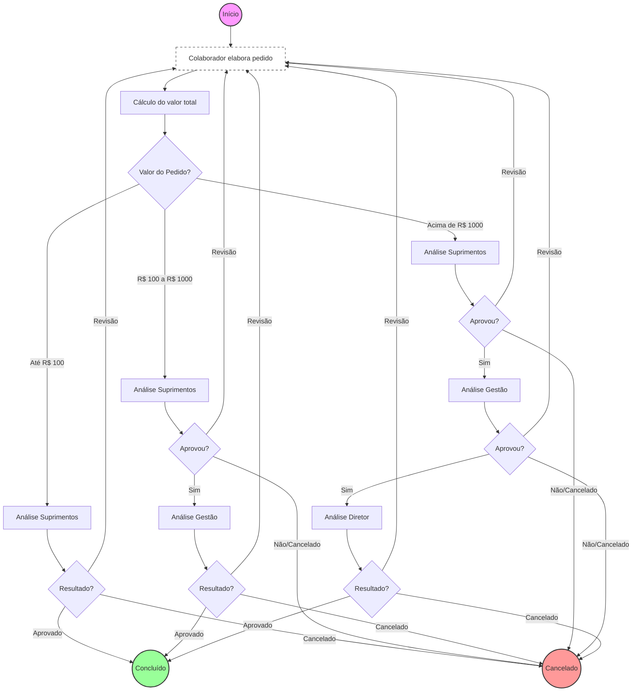
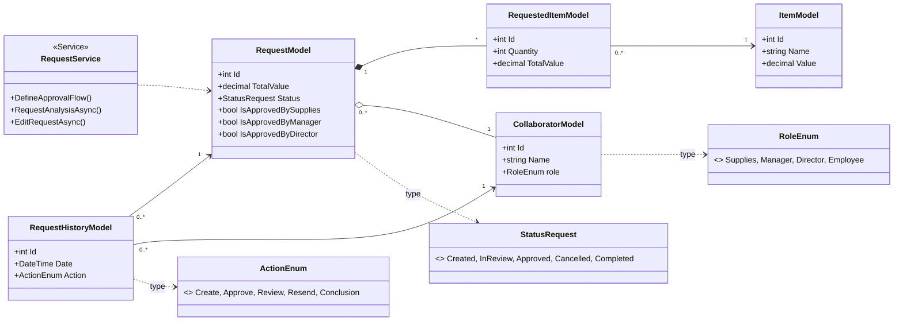

Este projeto consiste na elaboração de um gestor de fluxo de pedidos.
O fluxo consiste em: um colaborador solicita um pedido e deve mandar para aprovação de determinados setores de acordo com o valor total do pedido. Um pedido até 100 reais precisa da aprovação do setor de suprimentos, um pedido maior que 100 reais até 1000 reais precisa da aprovação do setor de suprimentos e da gestão, e um pedido maior que mil reais precisa da aprovação do setor de suprimentos, da gestão e da direção. Em qualquer etapa do fluxo de aprovação o pedido pode ser cancelado ou pode ser posto para revisão. Uma vez que ele é posto para revisão o pedido volta ao colaborador criador para ser editado e passar pelo fluxo de aprovação novamente.

O projeto foi implementado em C# (.NET 10) usando SQL server como banco de dados e o Insomnia para testes da API e o Entity Framework Core para as migrations.
A API possui os métodos POST, para criar pedidos, Itens e Colaboradores. Possui o método GET para retornar os pedidos, historico dos pedidos, colaboradores e Itens. Possui o metodo PUT para editar os pedidos e para analisar os pedidos (Definir o fluxo).

O diagrama do Banco de Dados e os testes do Insomnia estão na pasta assets.

Para executar o projeto, clone o repositório git clone [https://github.com/PaulaMonteverde/DesafioiALL.git](https://github.com/PaulaMonteverde/DesafioiALL.git)
No Package Manages do Visual studio dê update no banco de dados: Update-Database.
Aperte F5 para dar play na aplicação.
Teste o projeto no Insomnia pois como o projeto está no .NET 10, ele não possui suporte para o swagger.

