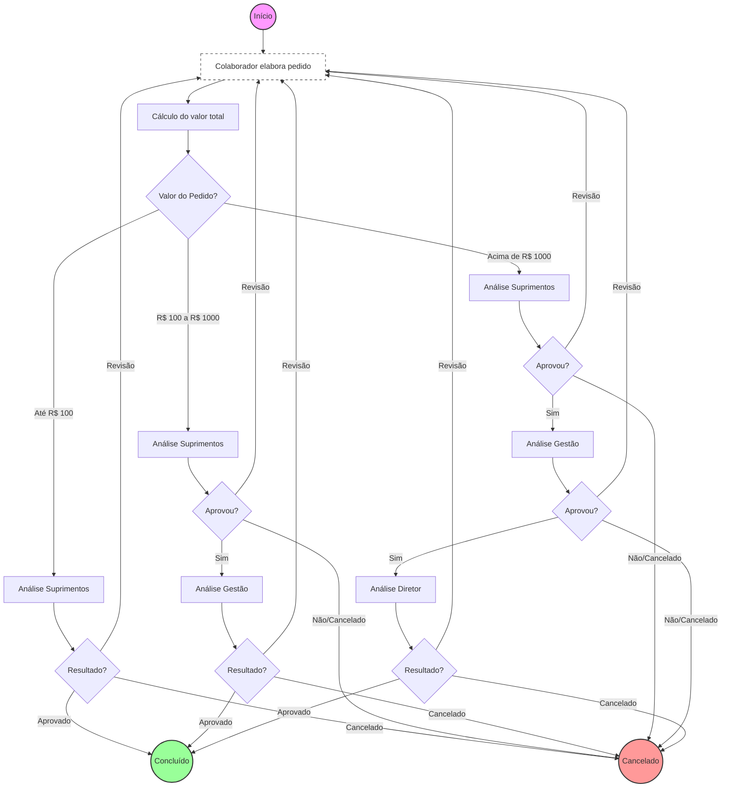

```mermaid
graph TD
    %% Início do Processo
    Start((Início)) --> Create[Colaborador elabora pedido]
    Create --> Calc[Cálculo do valor total]
    
    %% Decisão de Faixa de Valor
    Calc --> ValueSwitch{Valor do Pedido?}

    %% FAIXA 1: Até 100 reais
    ValueSwitch -- "Até R$ 100" --> SupCheck1[Análise Suprimentos]
    SupCheck1 --> Res1{Resultado?}
    Res1 -- Aprovado --> Done((Concluído))
    Res1 -- Cancelado --> Cancel((Cancelado))
    Res1 -- Revisão --> Create

    %% FAIXA 2: 100 a 1000 reais
    ValueSwitch -- "R$ 100 a R$ 1000" --> SupCheck2[Análise Suprimentos]
    SupCheck2 --> Res2{Aprovou?}
    Res2 -- Não/Cancelado --> Cancel
    Res2 -- Revisão --> Create
    Res2 -- Sim --> GestCheck2[Análise Gestão]
    GestCheck2 --> Res3{Resultado?}
    Res3 -- Aprovado --> Done
    Res3 -- Cancelado --> Cancel
    Res3 -- Revisão --> Create

    %% FAIXA 3: Maior que 1000 reais
    ValueSwitch -- "Acima de R$ 1000" --> SupCheck3[Análise Suprimentos]
    SupCheck3 --> Res4{Aprovou?}
    Res4 -- Não/Cancelado --> Cancel
    Res4 -- Revisão --> Create
    Res4 -- Sim --> GestCheck3[Análise Gestão]
    GestCheck3 --> Res5{Aprovou?}
    Res5 -- Não/Cancelado --> Cancel
    Res5 -- Revisão --> Create
    Res5 -- Sim --> DirCheck[Análise Diretor]
    DirCheck --> Res6{Resultado?}
    Res6 -- Aprovado --> Done
    Res6 -- Cancelado --> Cancel
    Res6 -- Revisão --> Create

    %% Estilização para ficar mais bonito
    style Start fill:#f9f,stroke:#333,stroke-width:2px
    style Done fill:#9f9,stroke:#333,stroke-width:2px
    style Cancel fill:#f99,stroke:#333,stroke-width:2px
    style Create fill:#fff,stroke:#333,stroke-dasharray: 5 5
```
